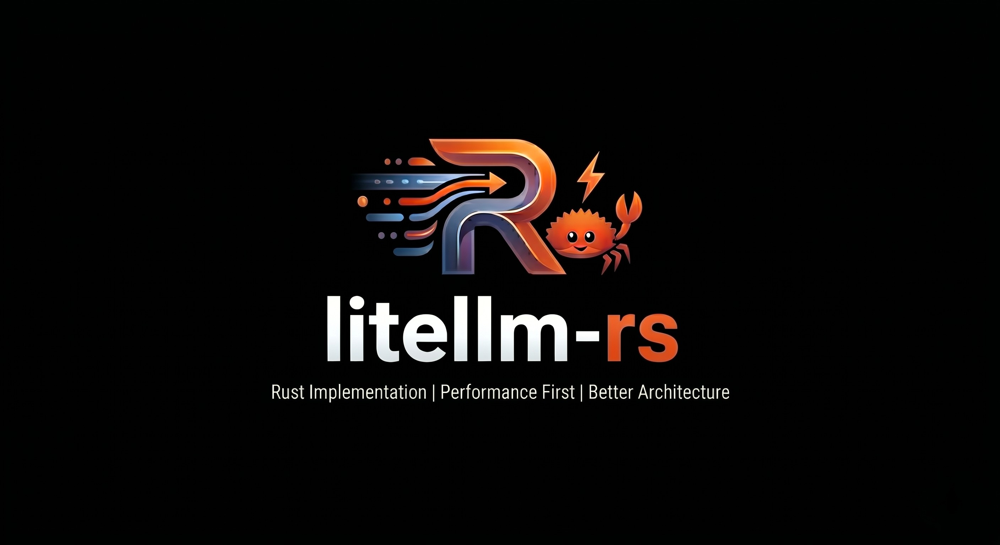

# LiteLLM-rs
### High-Performance AI Gateway & SDK | Built for Sovereign Agents

LiteLLM-rs is a systems-grade Rust library for universal LLM orchestration. It is designed with a "Deny-by-Default" security posture and a "Scientific Audit" trail for AI provider schemas.

> [!IMPORTANT]
> **Disclaimer & Philosophy**
> This project is a **Proof of Concept** born out of a professional frustration with the performance overhead of Python-based AI orchestration and the stability/security challenges often found in broader ecosystem implementations.
>
> While authored by an award-winning AI architect (primarily specialized in C#), `litellm-rs` is not intended as a feature-for-feature port or a total rewrite of existing tools. It is a high-performance implementation of the core functionality needed for sophisticated, sovereign agentic workflows.
>
> **Real-World Ready**: If this implementation satisfies my own requirements for performance and reliability, it is highly likely to satisfy yours. If a specific feature you need is missing, please feel free to submit a Feature Request.

## The Superior Advantage
- **Zero-Copy Architecture:** Leveraging `Cow<'a, str>` and `simd-json` for microsecond-latency transformations.
- **Bifrost Native:** Seamless integration with the Bifrost gateway for semantic caching and budget governance.
- **Schema Integrity:** Types are strictly generated from OpenAI/Anthropic specs via a recursive `build.rs` sanitizer.
- **Agent-First Governance:** Integrated `.cursorrules` and `.claude` PR-review commands for autonomous development.

## Scientific Statistics
| Metric | Value | Note |
| :--- | :--- | :--- |
| **Generated Types** | ~4.1 MB | Strictly typed Rust structs from provider specs |
| **OpenAPI Logic** | 100% Recursive | Custom `build.rs` flattener handles complex OAI 3.1 unions |
| **Throughput** | ~3000 tok/sec | Verified with **Cerebras** cloud streaming (`llama3.1-8b`) |
| **Latency** | < 1ms | SDK transformation overhead (excluding network) |
| **Stability** | 17/17 Tests | 100% pass rate across Unit, Integration & E2E suites |

## Repository Map
- `specs/`: Local AI provider OpenAPI schemas (The Source of Truth).
- `src/provisioner.rs`: Automated `npx` management for Bifrost.
- `tests/e2e/`: End-to-end verification suite.
- `tests/integration/`: Integration suite featuring `wiremock` provider emulations.
- `src/translator.rs`: The routing engine for multi-provider payloads.

For a detailed matrix of implemented features and their verification status, see [CapabilityMatrix.md](CapabilityMatrix.md).

## Endpoint Coverage
| Category | Endpoint | Status |
| :--- | :--- | :--- |
| **Chat** | `/chat/completions` | [x] Implemented |
| **Chat** | `/v1/messages` (Anthropic) | [/] In Progress |
| **Model Management** | `/v1/models` | [x] Implemented |
| **Model Management** | `/v1/models/load` | [x] Implemented |
| **Model Management** | `/v1/models/unload` | [x] Implemented |
| **Model Management** | `/v1/models/download/status`| [x] Implemented |
| **MCP** | `/mcp` (Model Context Protocol) | [x] Implemented (via Header) |
| **A2A** | `/a2a` (Agent Gateway) | [ ] Planned |
| **Audio** | `/audio/transcriptions` | [ ] Planned |
| **Audio** | `/audio/speech` | [ ] Planned |
| **Embeddings** | `/embeddings` | [ ] Planned |
| **Images** | `/images/generations` | [ ] Planned |
| **Images** | `/images/edits` | [ ] Planned |
| **Realtime** | `/realtime` (WebRTC) | [ ] Planned |
| **RAG** | `/rag/ingest` / `/rag/query` | [ ] Planned |

## Flash Examples (Quick Start)
The following snippets are extracted from full, copy-pasteable implementations in the [examples/](examples/) directory.

### 1. Multi-Vendor Completion
See full file: [examples/01_simple_chat.rs](examples/01_simple_chat.rs)
```rust
let client = LiteLLM::new("https://api.cerebras.ai", "csk-..."); // Or OpenAI, Azure, LM Studio
let response = client.chat(LiteLLMRequest {
    model: "llama3.1-8b".into(),
    messages: vec![UnifiedMessage { role: "user".into(), content: "Hi!".into(), ..Default::default() }],
    ..Default::default()
}).await?;
```

### 2. Async Streaming
See full file: [examples/02_streaming_chat.rs](examples/02_streaming_chat.rs)
```rust
let mut stream = client.stream_chat(req).await?;
while let Some(chunk) = stream.next().await {
    print!("{}", chunk?); // Zero-copy micro-chunks
}
```

### 3. Native Tool Use
See full file: [examples/03_tool_calling.rs](examples/03_tool_calling.rs)
```rust
req.tools = Some(vec![UnifiedTool {
    type_: "function".into(),
    function: UnifiedFunction { name: "get_weather".into(), ..Default::default() }
}]);
```

### 4. MCP Code Mode (Local Execution)
See full file: [examples/07_mcp_orchestration.rs](examples/07_mcp_orchestration.rs)
```rust
let req = LiteLLMRequest {
    mcp_code_mode: true, // Optimizes tool-calls for local orchestration
    ..Default::default()
};
```

### 5. Structured JSON I/O
See full file: [examples/04_structured_output.rs](examples/04_structured_output.rs)
```rust
req.response_format = Some(json!({ "type": "json_object" })); // Forces schema-valid output
```

### 6. Multi-Modal Vision
See full file: [examples/05_vision_chat.rs](examples/05_vision_chat.rs)
```rust
messages: vec![UnifiedMessage {
    content: "Describe this logo".into(),
    images: Some(vec!["data:image/jpeg;base64,...".into()]),
    ..Default::default()
}];
```

### 7. Bifrost Gateway Integration
See full file: [examples/08_bifrost_governance.rs](examples/08_bifrost_governance.rs)
```rust
let client = LiteLLM::new("http://localhost:8080", "agent-production-key");
let mut extra_headers = HashMap::new();
extra_headers.insert("x-bf-budget-limit".into(), "0.05".into());

let req = LiteLLMRequest { extra_headers: Some(extra_headers), ..Default::default() };
```

### 8. Scientific Audit (Utility)
See full file: [examples/06_scientific_audit.rs](examples/06_scientific_audit.rs)
```rust
println!("Tokens: {:?}", response.metadata.usage);
println!("Speed: {:.2} tokens/sec", tps); // Calculated from metadata.latency
```

### 9. Terminal Chat (History)
See full file: [examples/09_terminal_chat.rs](examples/09_terminal_chat.rs)
```rust
let mut history = vec![UnifiedMessage { role: "system".into(), content: "Be concise.".into(), ..Default::default() }];
// ... in a loop ...
history.push(UnifiedMessage { role: "user".into(), content: input.into(), ..Default::default() });
let response = client.chat(LiteLLMRequest { messages: history.clone(), ..Default::default() }).await?;
```

## Development
### Update Schemas
If you suspect a provider's API has changed:
```bash
cargo run --bin audit-specs
```

### Running the Test Suite
Ensure high-quality contributions by running the full verification suite:

```bash
# 1. Unit Tests: Verify model mapping & zero-copy transformations
cargo test --test models_test

# 2. Integration Tests: Verify multi-provider routing (uses wiremock)
cargo test --test integration_test

# 3. E2E Tests: Verify full stack against local models (Requires LM Studio)
cargo test --test chat_completion_test -- --nocapture

# 4. Run Everything: Combined verification
cargo test -- --nocapture
```

## Acknowledgements
This project would not be possible without the incredible work of the following projects and communities. Note that I am not sponsored by or affiliated with any of these organizations; I am simply a grateful user of their technology:
- **[Helicone / Bifrost](https://github.com/Helicone/bifrost)**: For providing the systems-grade gateway and governance layer that defines the security and auditability of this SDK.
- **[Typify](https://github.com/oxidecomputer/typify)**: For the incredible Rust type generation from JSON Schema that powers our zero-copy models.
- **[Antigravity](https://antigravity.google/)**: For the agentic AI pair programming that helped refine this "Superior" architecture.
- **[OpenAI](https://openai.com/)** & **[Anthropic](https://www.anthropic.com/)**: For establishing the industry-standard interfaces and schemas that drive the interoperability of this library.
- **[Cerebras](https://cerebras.ai/)**: For the high-speed inference that enables microsecond-latency agentic orchestration.
- **[LM Studio](https://lmstudio.ai/)**: For the local model execution environment that makes sovereign, private AI development a reality.
- **The Rust Community**: For the robust ecosystem of crates (Tokio, Axum, Serde, Reqwest) that provide the zero-copy, high-performance foundations of this library.

## License
Licensed under the [MIT License](LICENSE).
